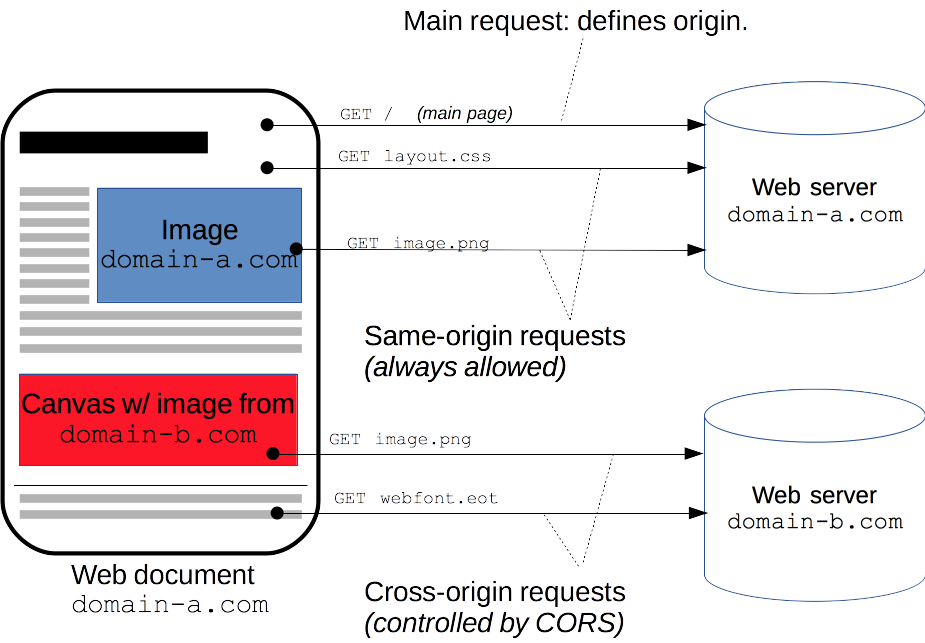

# XHR's `.open()` method

So we've constructed an XHR object named `asyncRequestObject`. There are a number of methods that are available to us. One of the most important is the [open method](https://developer.mozilla.org/en-US/docs/Web/API/XMLHttpRequest/open).

```js
asyncRequestObject.open();
```

`.open()` takes a number of parameters, but the most important are its first two: the **HTTP method** and **URL** to send the request

If we want to asynchronously request the homepage from the popular high-res image site, Unsplash, we'd use a `GET` request and provide the URL:

```js
asyncRequestObject.open('GET', 'https://unsplash.com');
```

## A little rusty on your HTTP methods?

The main two that you'll be using are:

- `GET` - to retrieve data
- `POST` - to send data

For more info, check out our course on [HTTP & Web Servers](https://classroom.udacity.com/courses/ud303)!

> **Warning:** 
>
>For security reasons, you can only make requests for assets and data on the same domain as the site that will end up loading the data. For example, to asynchronously request data from google.com your browser needs to be on google.com. This is known as the [same-origin policy](https://developer.mozilla.org/en-US/docs/Web/Security/Same-origin_policy). This might seem extremely limiting, and it is!
>
>The reason for this is because JavaScript has control over so much information on the page. It has access to all cookies and can determine passwords since it can track what keys are pressed. 
>
>However, the web wouldn't be what it is today if all information was bordered off in its own silos. The way to circumvent the same-origin policy is with [CORS](https://developer.mozilla.org/en-US/docs/Web/HTTP/Access_control_CORS) (Cross-Origin Resource Sharing). CORS must a technology that is implemented on the server. Services that provide APIs use CORS to allow developers to circumvent the same-origin policy and access their information.



### QUESTION 1 OF 2

Go to [Google](https://www.google.com/), open up the developer tools, and run the following on the console:

```js
const req = new XMLHttpRequest();
req.open('GET', 'https://www.google.com/');
```
What happens?

- [ ] The Google homepage open in the browser
- [ ] An async request sent to https://www.google.com
- [X] Nothing happens
- [ ] An error occurs

### Answer-Nothing Happens

The XHR's `.open()` method does not actually send the request! It sets the stage and gives the object the info it will need when the request is actually sent. A bit anti-climactic… So let's actually send the request!

### QUESTION 2 OF 2

An XHR object's `.open()` method can take a number of arguments. Use the [documentation](https://developer.mozilla.org/en-US/docs/Web/API/XMLHttpRequest/open) to explain what the following code does:

```js
const myAsyncRequest = new XMLHttpRequest();
myAsyncRequest.open('GET', 'https://udacity.com/', false);
```

- [ ] Nothing special, this is the standard way `.open()` works.
- [ ] The request is sent immediately.
- [X] The JavaScript freezes and waits until the request is returned.

Passing false as the third option makes the XHR request become a ***synchronous*** one. This will cause the JavaScript engine to pause and wait until the request is returned before continuing - this "pause and wait" is also called "blocking". 

This is a terrible idea and completely defeats the purpose for having an asynchronous behavior. Make sure you never set your XHR objects this way! Instead, either pass `true` as the 3rd argument or leave it blank (which makes it default to `true`).'