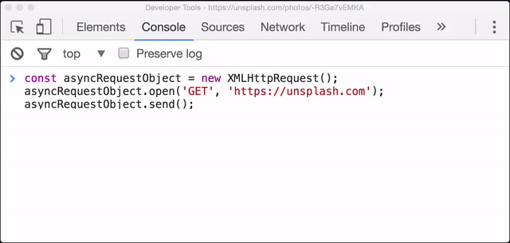

# XHR's `.send()` method

To actually send the request, we need to use the [send method](https://developer.mozilla.org/en-US/docs/Web/API/XMLHttpRequest/send):

```js
asyncRequestObject.send();
```

Let's check out what happens:

*The XHR request is sent, but we don''t see anything!*

[Video](https://youtu.be/m9C0LJoWhOE)

It's a little pointless to make a request for something but then do absolutely nothing with it! Why would you order some cake and then not go to pick it up or not eat it? The horror! We want to eat our cake, too!

## Handling Success

To handle the successful response of an XHR request, we set the [onload property](https://developer.mozilla.org/en-US/docs/Web/API/XMLHttpRequestEventTarget/onload) on the object to a function that will handle it:

```js
function handleSuccess () {
    // in the function, the `this` value is the XHR object
    // this.responseText holds the response from the server

    console.log( this.responseText ); // the HTML of https://unsplash.com/
}

asyncRequestObject.onload = handleSuccess;
```

As we just saw, if `onload` isn't set, then the request does return...but nothing happens with it.

## Handling Errors

You might've picked up that **onload** is called when the response is successful. If something happens with the request and it can't be fulfilled, then we need to use the **onerror property**:

```js
function handleError () {
    // in the function, the `this` value is the XHR object
    console.log( 'An error occurred 😞' );
}

asyncRequestObject.onerror = handleError;
```

As with `onload`, if `onerror` isn't set and an error occurs, that error will just fail silently and your code (and your user!) won't have any idea what's wrong or any way to recover."