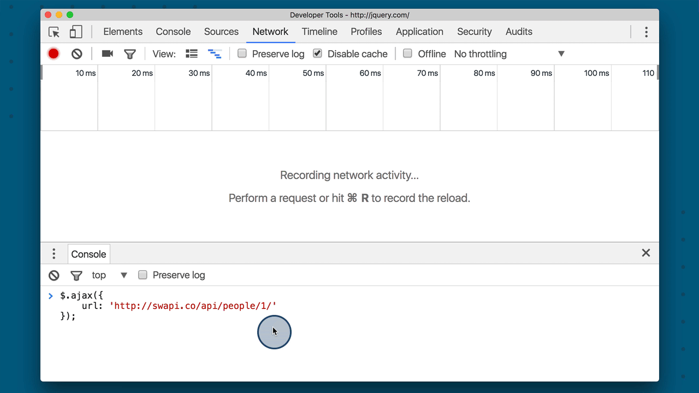

# jQuery's `ajax()` Method

The [`.ajax()` method](http://api.jquery.com/jquery.ajax/) is at the heart of all asynchronous requests for the entire jQuery library. There are a couple of ways you can call the `.ajax()` method:

```js
$.ajax(<url-to-fetch>, <a-configuration-object>);

// or

$.ajax(<just a configuration object>);

```

The most common way to use the `.ajax()` method is with just the configuration object, since everything can be set inside the configuration object.

## What's a "configuration object"?

A configuration object is just a plain ol' JavaScript object that's used to configure something. For example:

```js
var settings = {
  frosting: 'buttercream',
  colors: ['orange', 'blue'],
  layers: 2,
  isRound: true
};
```

...the `settings` configuration object can be used in the imaginary `MakeCake` constructor function:

```js
const myDeliciousCake = MakeCake( settings );
```

Alternatively, the `settings` object could be passed in directly:

```js
const myDeliciousCake = MakeCake({
   frosting: 'buttercream',
   colors: ['orange', 'blue'],
   layers: 2,
   isRound: true
});
```

## Making an Ajax call
jQuery's `.ajax()` method has to be incredibly versatile and powerful if it's what powers all of jQuery's asynchronous requests. A simple Ajax request would look like this:

```js
$.ajax({
    url: 'http://swapi.co/api/people/1/'
});
```

### Let's test it out!

go to the [jQuery website](http://jquery.com/)
open up your browser's developer tools
make sure the network traffic is being recorded
in Chrome, switch to the network pane
add the request above to the console
...aaaand run it!

 *Running an asynchronous request in the console. The request is for a resource on SWAPI. The request is displayed in the network pane.*

So we can make a request with `.ajax()`, but we haven't handled the response yet.