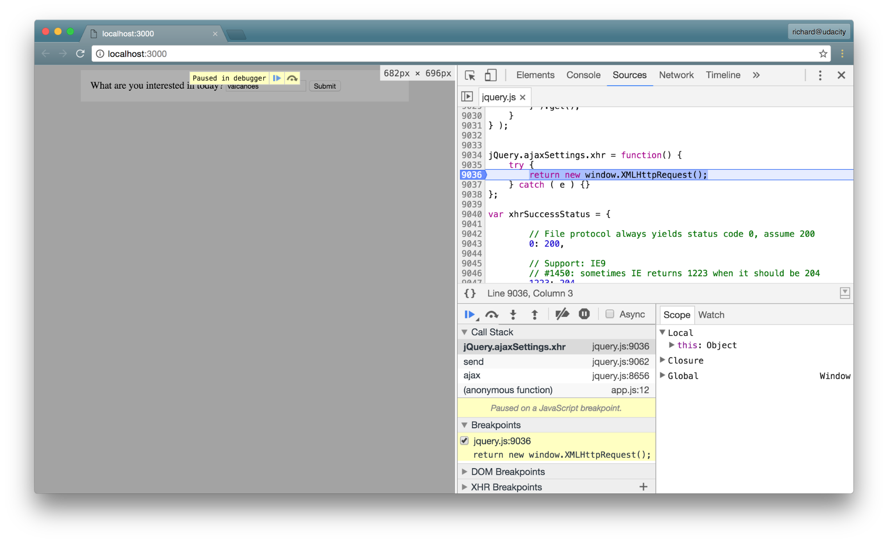

# Peek inside `$.ajax()`

[video](https://youtu.be/kSOsySJGerA)

We're about to dig into jQuery's source for a second. To do that, you need to:

1. open up the project in a browser
1. open up DevTools
1. switch to the "Sources" pane
1. open up the `jquery.js` file
    1. in Chrome, you can open a specific file by searching for it with ctrl/command + P
1. set a breakpoint on line `9036`

A breakpoint set in the jQuery source file right where new XMLHttpRequest object is created

## Search For A Topic

Now that we've added the breakpoint, if we do a search, then the JavaScript code will run (which will use jQuery's `.ajax()` method!) and DevTools will pause when it hits the line with the breakpoint. So go ahead and do a search to cause the code to break at the breakpoint. Why not search for something exciting like "Volcanoes"!

*DevTools paused at breakpoint*

## Debugging in Chrome

> ***TIP:***
>
> If you've never done it before, debugging is a JavaScript application can seem like a complicated process. We'll be looking at the important parts of DevTools in this course, but if you're looking for a deeper dive, check out the following resources on Google's Developer site:

[Pause Your Code With Breakpoints](https://developers.google.com/web/tools/chrome-devtools/javascript/breakpoints)

[JavaScript Debugging Reference](https://developers.google.com/web/tools/chrome-devtools/javascript/reference)